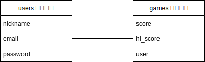

# README

# アプリケーション名
殿を守れ

# アプリケーション概要
殿様の命を狙って城に侵入してくる忍者を倒すゲーム

# アプリの利用方法
新規登録・ログイン、もしくはゲストログインにて遊んでください。 
ゲームスタート後は落ちてくる忍者に合わせてクリックすると点数がカウントされます。 
10秒後に結果画面に自動的に移動します。

# URL
https://tonowomamore.onrender.com

# ゲームプレーGIF
https://user-images.githubusercontent.com/112855899/201569544-c6bfe930-e4b4-4cdf-be88-658661e7343d.mp4

# 実装予定機能
・点数のランキング機能 
・週毎のランキングリセット機能　・ゲーム難易度の設定 
・BGMの導入　・キャラと落下スピードのランダム化 
・キャラ毎、スピード毎に点数を変えること 
・ゲーム中に離脱しようとする際に「本当に戻りますか？」の 
　ポップアップを表示する機能

# DB設計

# 画面遷移図

# テーブル設計

## users テーブル

| Column              | Type    | Options                   |
| ------------------- | ------- | ------------------------- |
| nickname            | string  | null: false, unique: true |
| email               | string  | null: false, unique: true |
| encrypted_password  | string  | null: false               |

### Association

- has_one :game

## games テーブル

| Column              | Type       | Options                         |
| ------------------- | ---------- | ------------------------------- |
| score               | string     | null: false                     |
| hi-score            | string     | null: false                     |
| user                | references | null: false, foreign_key: true  |

### Association

- belongs_to :user
